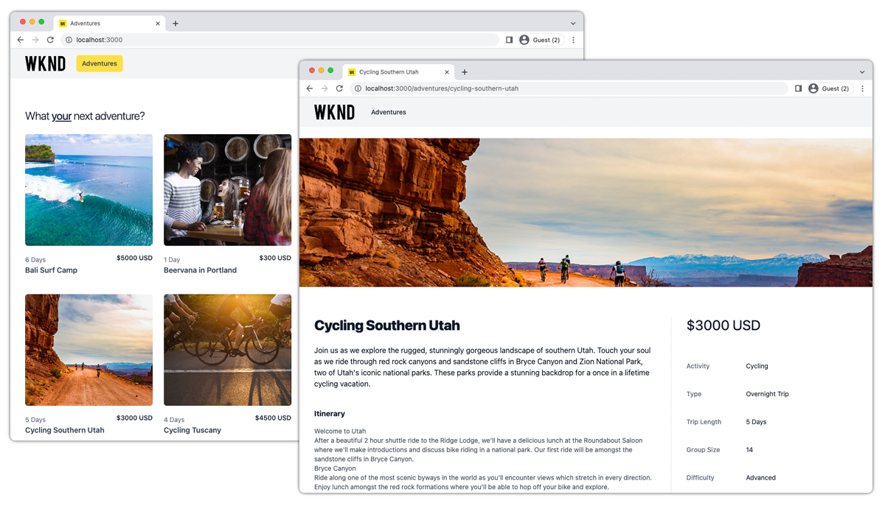

# Next.js App - WKND Adventures

An example Next.js application that highlights Adobe Experience Manager's GraphQL APIs and the [AEM Headless Client for JavaScript](https://github.com/adobe/aem-headless-client-js).

This application is loosely based on the [Adobe Next.js Template](https://github.com/adobe/aem-nextjs-template/) but has been trimmed to focus on the AEM Headless GraphQL use case.

## How to use

Visit Adobe Experience League for [instructions on how to run this Next.js app](https://experienceleague.adobe.com/docs/experience-manager-learn/getting-started-with-aem-headless/how-to/example-apps/next-js.html).

## System Requirements

 AEM as a Cloud Service | AEM 6.5 | Sample Content | Node   | npm | 
------------------------|---------|--------------------|---------|-----|
Continual               | 6.5.13+ |  [WKND Shared 2.0+](https://github.com/adobe/aem-guides-wknd-shared/releases/latest) or [WKND Site 2.0+](https://github.com/adobe/aem-guides-wknd/releases/latest)| 10+  | 6+

## Notes

## Documentation

* [AEM Headless Tutorials](https://experienceleague.adobe.com/docs/experience-manager-learn/getting-started-with-aem-headless/overview.html)
* [AEM Headless Developer Journey](https://experienceleague.adobe.com/docs/experience-manager-cloud-service/headless-journey/developer/overview.html)
* [AEM Headless Client for JavaScript](https://github.com/adobe/aem-headless-client-js)
