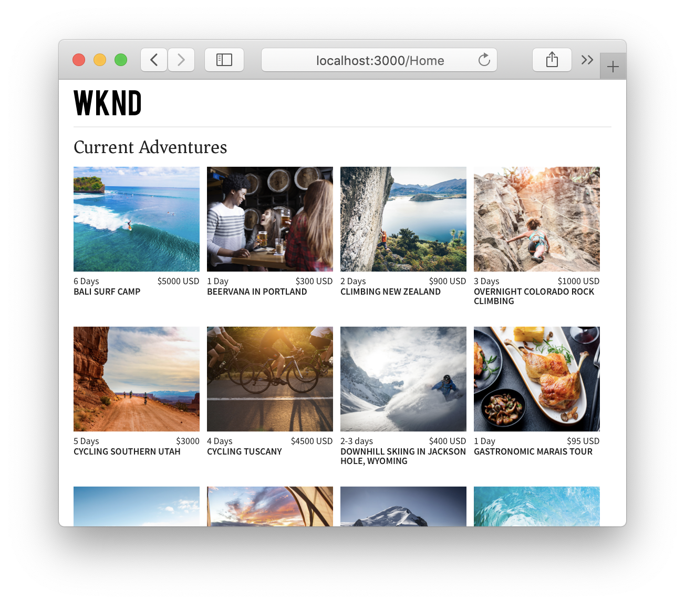
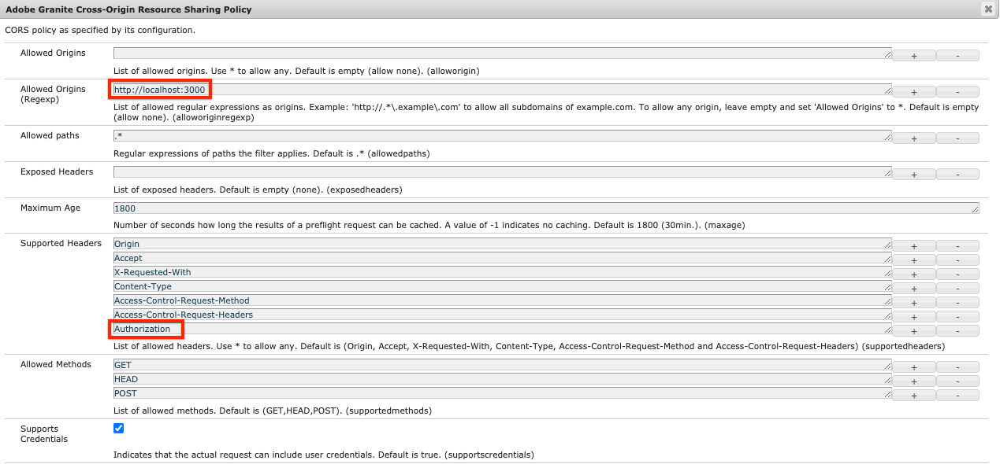

# AEM Guides WKND GraphQL - React App

An example React application that highlights Adobe Experience Manager's GraphQL APIs.

This project was bootstrapped with [Create React App](https://github.com/facebook/create-react-app).



## Quickstart

Run the commands:

```
$ cd aem-guides-wknd-graphql/react-app
$ npm install
$ npm start
```

## Connecting to AEM

This project assumes that the AEM environment has the GraphQL API feature **enabled**. The GraphQL APIs are not enabled by default in AEM as a Cloud Service environments.

> Interested in accessing the GraphQL feature? Contact your Adobe representative.

### Install Sample Content

This project relies on sample content from the WKND Reference site. Install the [WKND Reference Site on your local AEM environment](https://github.com/adobe/aem-guides-wknd/releases/latest).

### Install Sample Endpoints

This project relies on GraphQL endpoints and configurations installed. Build and install the sample [AEM Project](../aem-project/README.md) on the target AEM environment.

### Update Environment Variables

Several [environment variables](https://create-react-app.dev/docs/adding-custom-environment-variables) are used by this project to connect to an AEM environment. Default connects to an AEM author environment running at http://localhost:4502. If you wish to change this behavior update the `.env.development` file accordingly:

* `REACT_APP_HOST_URI=http://localhost:4502` - Set to AEM target host
* `REACT_APP_GRAPHQL_ENDPOINT=/content/graphql/endpoint.gql` - Set the GraphQL endpoint path
* `REACT_APP_AUTHORIZATION=admin:admin` - set basic auth credentials to use if connecting to an AEM Author environment (for development only). If connecting to a Publish environment, this setting is not necessary.

### Proxy API Requests

When using the webpack development server (`npm start`) the project relies on a [proxy setup](https://create-react-app.dev/docs/proxying-api-requests-in-development/#configuring-the-proxy-manually) using `http-proxy-middleware`. The file is configured at [src/setupProxy.js](src/setupProxy.js) and relies on several custom environment variables set at `.env` and `.env.development`.

If connecting to a local AEM author environment, no updates are needed.

### CORS - Cross Origin Resource Sharing

This project relies on a CORS configuration running on the target AEM environment and assumes that the app is running on http://localhost:3000 in development mode. The [CORs configuration](../aem-project/ui.config/src/main/content/jcr_root/apps/wknd-graphql/osgiconfig) is part of the sample [AEM Project](../aem-project/README.md).



*CORS config*

## Installation

### `npm install`

## Available Scripts

In the project directory, you can run:

### `npm start`

Runs the app in the development mode.<br />
Open [http://localhost:3000](http://localhost:3000) to view it in the browser.

The page will reload if you make edits.<br />
You will also see any lint errors in the console.

### `npm test`

Launches the test runner in the interactive watch mode.<br />
See the section about [running tests](https://facebook.github.io/create-react-app/docs/running-tests) for more information.

### `npm build`

Builds the app for production to the `build` folder.<br />
It correctly bundles React in production mode and optimizes the build for the best performance.

The build is minified and the filenames include the hashes.<br />
Your app is ready to be deployed!
