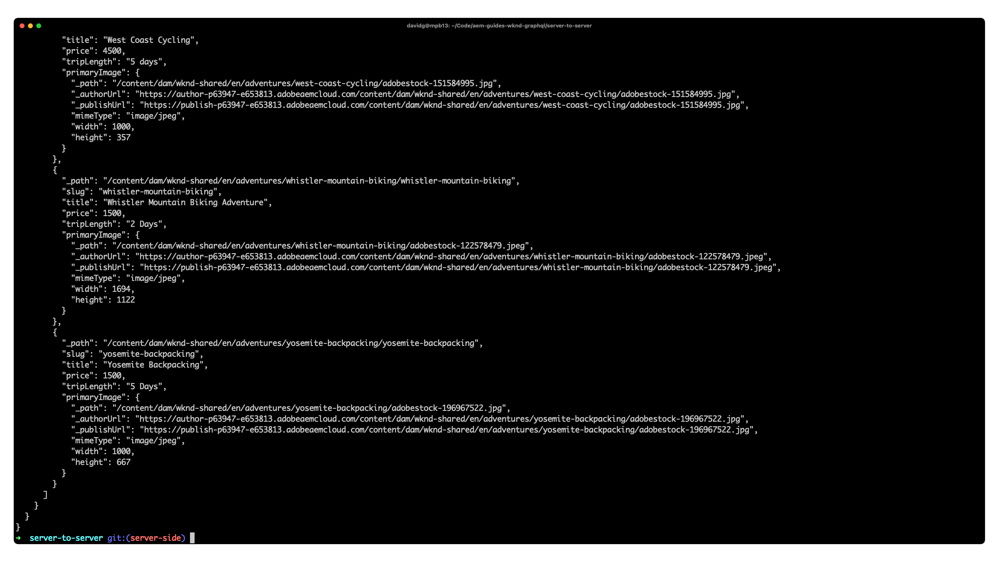

# Server-to-server Node.js App - WKND Adventures

An example server-to-server Node.js application that highlights Adobe Experience Manager's GraphQL APIs and the [AEM Headless Client for Node.js](https://github.com/adobe/aem-headless-client-nodejs). This application is simple: it queries AEM for WKND adventure data, and prints out the JSON response. Typically server-to-server applications will retrieve data from AEM and sync it with other systems, or generate some other form of output.



## Tutorial

A corresponding [tutorial](https://experienceleague.adobe.com/docs/experience-manager-learn/getting-started-with-aem-headless/graphql/example-apps/server-to-server-app.html) is available where you can learn how to setup and run the application to query data from an AEM environment using GraphQL.

## How to use

1. Download and install [Node.js](https://nodejs.org/en/) and [npm](https://www.npmjs.com/)
1. Clone this git repository
1. Run the app from the command line. You will need an AEM as a Cloud Service host (for example, `https://publish-p123-e789.adobeaemcloud.com`) and optionally an AEM as a Clouds Service [service credentials file](https://experienceleague.adobe.com/docs/experience-manager-cloud-service/content/implementing/developing/generating-access-tokens-for-server-side-apis.html) if the GraphQL requests require authorization.

    ```shell
    $ cd aem-guides-wknd-graphql/server-to-server-app
    $ npm install
    $ node index.js AEM_HOST
    or 
    $ node index.js AEM_HOST RELATIVE_PATH_TO_SERVICE_CREDENTIALS
    ```

## System Requirements

| AEM as a Cloud Service | Sample Content | Node   | npm | 
|------------------------|---------|--------------------|---------|
| Continual               |  [WKND Shared 2.0+](https://github.com/adobe/aem-guides-wknd-shared/releases/latest) or [WKND Site 2.0+](https://github.com/adobe/aem-guides-wknd/releases/latest)| 10+  | 6+

## Documentation

* [AEM Headless Tutorials](https://experienceleague.adobe.com/docs/experience-manager-learn/getting-started-with-aem-headless/overview.html)
* [AEM Headless Developer Journey](https://experienceleague.adobe.com/docs/experience-manager-cloud-service/headless-journey/developer/overview.html)
* [AEM Headless Client for Node.js](https://github.com/adobe/aem-headless-client-nodejs)


