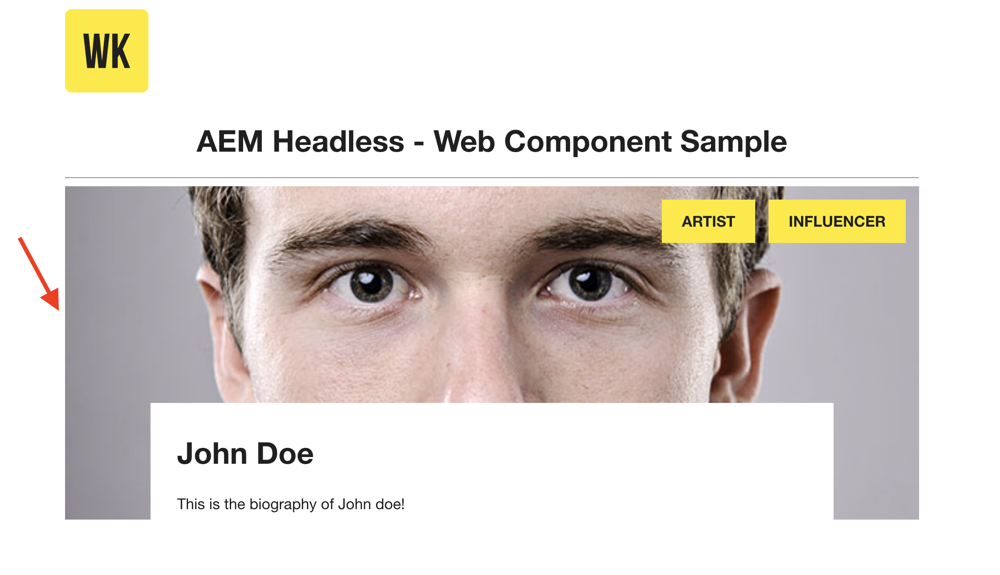

# Web Component - Person Info (`<person-info>` custom element)  - AEM Headless

An example [Web Component](https://developer.mozilla.org/en-US/docs/Web/Web_Components) that highlights Adobe Experience Manager's GraphQL APIs usage for AEM Headless use cases.

A reusable `<person-info>` custom element encapsulates the code that renders the Person Info by calling the persisted GraphQL query.

**Highlights**

1. In `.../src/assets/aem-headless.html` HTML file `<person-info>` custom element is used, like

    ```
    <person-info 
        host="https://publish-p65804-e666805.adobeaemcloud.com"
        query-param-value="John Doe">
    </person-info>
    ```

2. The `.../src/person.js` registers the `<person-info>` custom element and `PersonInfo` class object defines the behavior of the element.

    ```    
    // Create a Class for our Custom Element (person-info)
    class PersonInfo extends HTMLElement {
        // define behavior via lifecycle callback, invoke GraphQL API
    }
    
    ...

    // Define the person-info element
    customElements.define("person-info", PersonInfo);
    ```

**Reusable `<person-info>` web component on a page**



## How to use

1. On the target AEM environment install and replicate the `tutorial-solution-content.zip` from the [Solution Files](https://experienceleague.adobe.com/docs/experience-manager-learn/getting-started-with-aem-headless/graphql/multi-step/explore-graphql-api.html?lang=en#solution-files) using [Package Manager](http://localhost:4502/crx/packmgr/index.jsp).
1. Update the [headless service variable values](#update-service-variable-values) to point to your target AEM instance and add authentication (if needed)
1. Download and install [Node.js](https://nodejs.org/en/) and [npm](https://www.npmjs.com/)
1. Update the [CORS -Cross Origin Resource Sharing](#cors---cross-origin-resource-sharing) configs
1. Start the app from the command line:

    ```shell
    $ cd aem-guides-wknd-graphql/web-component
    $ npm install
    $ npm start
    ```

## Notes

## System Requirements

 AEM as a Cloud Service | AEM 6.5 | Sample Content | Node   | npm | 
------------------------|---------|--------------------|---------|-----|
Continual               | 6.5.13+ |  [Solution Files](https://experienceleague.adobe.com/docs/experience-manager-learn/getting-started-with-aem-headless/graphql/multi-step/explore-graphql-api.html?lang=en#solution-files) | 10+  | 6+


### Update Service Variable Values 

There are few _headless service variables_ are used by this example to connect to an AEM environment. If you wish to change this behavior update the [`person.js`](./src/person.js) file accordingly:

In `aemHeadlessService` object,

* `aemHost=https://publish-p65804-e666805.adobeaemcloud.com` -  AEM target host
* `graphqlAPIEndpoint=graphql/execute.json` - GraphQL endpoint path
* `projectName=my-project` - Project name (config)
* `persistedQueryName=person-by-name` - Persisted query name
* `queryParamName=name` - Query parameter name for above persisted query

In `aemCredentials` object,

* `username=admin` - basic auth _user_ credentials to use if connecting to an AEM Author environment (for development only). If connecting to a Publish environment, this setting is not necessary.
* `password=admin` -  basic auth _password_ used for connecting to an AEM Author environment (for development only). If connecting to a Publish environment, this setting is not necessary.

### CORS - Cross Origin Resource Sharing

Several CORS configurations must be set on the target AEM environment:

* OSGi CORS Configuration - A configuration can be deployed as part of an AEM project. [Example OSGi Config](https://github.com/adobe/aem-guides-wknd/blob/main/ui.config/src/main/content/jcr_root/apps/wknd/osgiconfig/config.publish/com.adobe.granite.cors.impl.CORSPolicyImpl~wknd-graphql.cfg.json#L21)

* Dispatcher headers - The AEM dispatcher must also be enabled to pass through the following client headers:

    ```
    "Origin"
    "Access-Control-Request-Method"
    "Access-Control-Request-Headers"
    ```

* [Example cached headers](https://github.com/adobe/aem-guides-wknd/blob/main/dispatcher/src/conf.dispatcher.d/available_farms/wknd.farm#L102)

* [Example client headers](https://github.com/adobe/aem-guides-wknd/blob/main/dispatcher/src/conf.dispatcher.d/clientheaders/clientheaders.any)


**This is a sample CORS config for local Author environment**

## Documentation

* [AEM Headless Tutorials](https://experienceleague.adobe.com/docs/experience-manager-learn/getting-started-with-aem-headless/overview.html)
* [AEM Headless Developer Journey](https://experienceleague.adobe.com/docs/experience-manager-cloud-service/headless-journey/developer/overview.html)